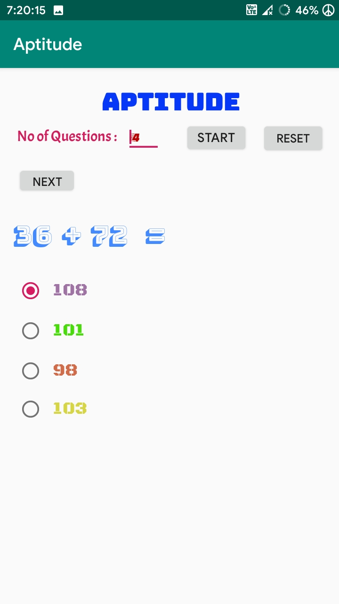

# AptitudeAndroidApp

This is a basic arithmetic quiz app where the questions are restricted to Addition,Subtraction,Multiplication and Division.
The questions are automatically generated in any number.
All the options are close to the original answer and it will calculate the time you took to complete the quiz.

# Android Version Support
From android 6 (Api 23) to 12 (Api 31)

# Screenshots 
 </img>
 </img>
 </img>

You can see that all options are close to original answer

 </img>
 </img>
 </img>
 </img>
 </img>
